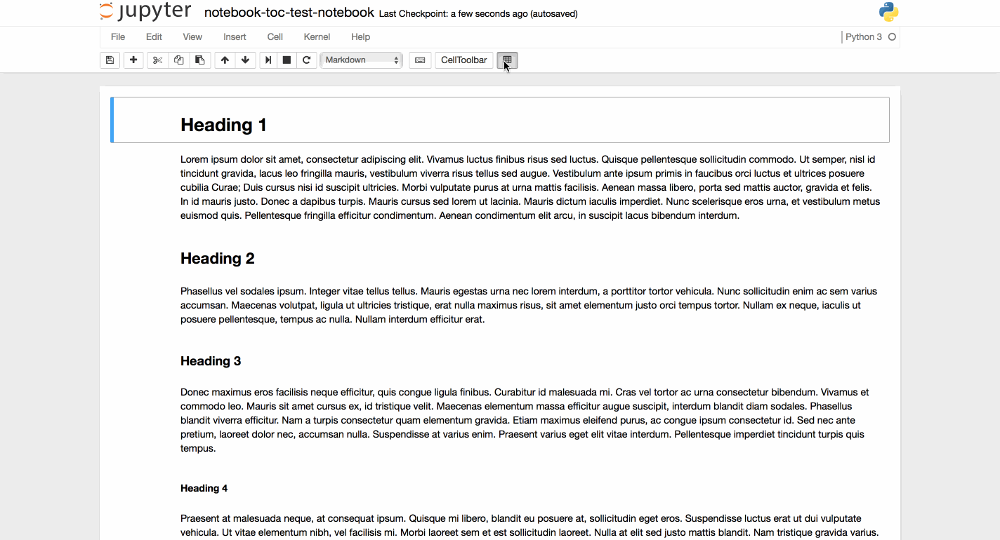

# notebook-toc
notebook-toc is a Jupyter Notebook extension for generating a table of contents 
at the top of the current Notebook. The extension creates clickable links that
scroll to the appropriate fragment when clicked.

### Installation Instructions
1. Run `ipython locate` to determine the location of your Jupyter Notebook configuration
2. Download `notebook-toc.js` and copy it to `$(ipython locate)/nbextensions`.
3. Run `jupyter nbextension enable notebook-toc`.

### Usage Screencast

